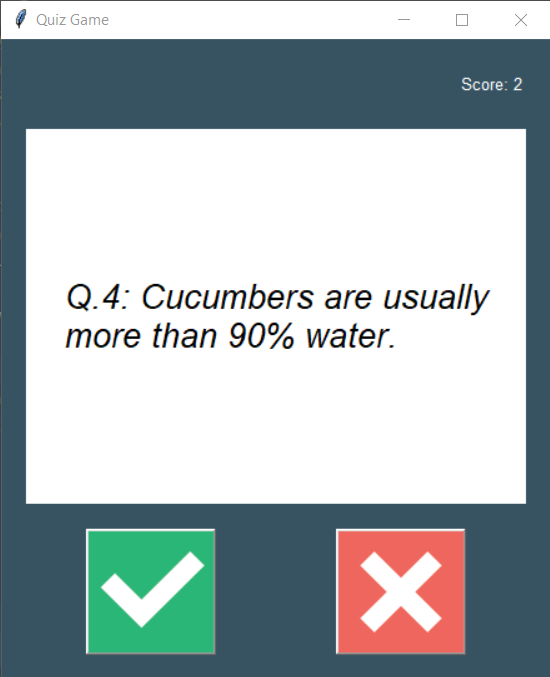

      ____  ____  ___    ____       _       _____             
     / __ \/ __ \/ _ \  / __ \__ __(____   / ______ ___ _ ___ 
    / /_/ / /_/ / ___/ / /_/ / // / /_ /  / (_ / _ `/  ' / -_)
    \____/\____/_/     \___\_\_,_/_//__/  \___/\_,_/_/_/_\__/ 
                                                              

---
Practicing Object-Oriented Programming in Python with a quiz game. 

### Images of app: 

